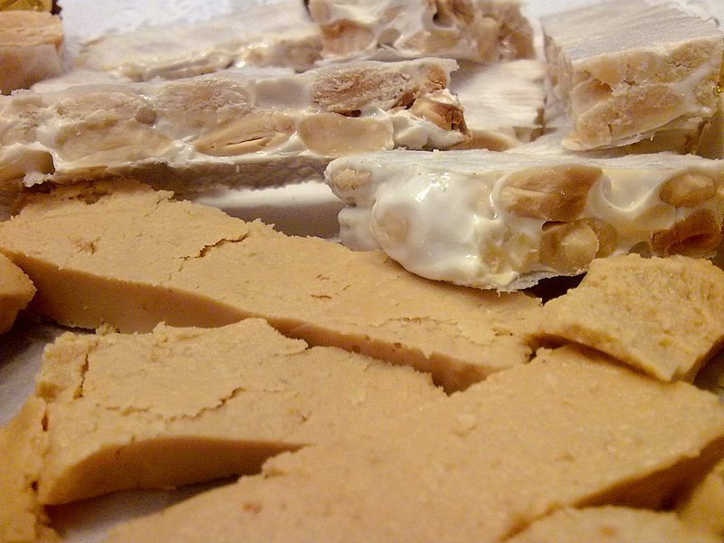

# The Turron Experiment
The Turron Experiment was a fun exercise conducted by [Eva Benito Garagorri](https://github.com/evilla-19) and [Alejandro Riera Mainar](http://github.com/ariera/) in 2019.

The main purpose was to learn (mainly Eva teaching Alex) things like experiment design, data collection, statistical analysis, reporting, and tools such as pandas, scipy, matplotlib & seaborn, etc...

To do that, **we conducted a turrón tasting experiment** with the collaboration of EMBO staff. Participants had to taste **2 different turrón varieties**, one that was **expensive** and one that was **cheap**. They didn't know which one was which, but **they had to score it and guess**.

## The study

In this respository, you can find:

* [The final report of our work](report.md)
* Along with the collected [source data](data.csv)
* And our [analysis script](analysis.py)

## F.A.Q.

#### Why did you do this?
We wanted to play around with data collection and analysis concepts and we thought conducting a real experiment would be fun and practical.

#### What is it turrón?

It is a typical spanish christmas sweet. Today comes in many different variations with all sort of ingredients, but the traditional one is made of almond and honey, in a shape and look similar to nougat in other countries.

For this experiment we chose the _soft_ version, called _Jijona_ variety, in which the almonds are reduced to a delicious paste.

<small>
_image source: https://commons.wikimedia.org/wiki/File:Turr%C3%B3n_blando_y_duro.jpg_
</small>

#### Why did you use turrón?
This was just by chance. Alex happened to have brought back 2 very differently priced varieties of the same kind of turrón from Spain so we went with that.

#### Why did you ask so many questions?
We wanted to collect as much data as possible in one go, so we asked about different aspects that have to do with taste and liking of turrón.

#### What's the main result?
That there is no difference in scoring between an expensive and a cheap turrón in a random sample of 24 participants that tasted blindly

#### How many people got it right?
50%

#### This is not really a serious experiment. Your sample size is too small. Your analysis is flawed. You did not formulate the right hypothesis [insert any other nasty (but probably true) statements here]
We know :-) We just wanted to play around with data collection and analysis concepts, this is just for demonstration purposes. Also, you were all wanting to know if you guessed correctly which one of the 2 turrones was the expensive one :-D

#### Can I see the data?
Yep! It's all right [here](data.csv)

## Contributing & reproducibility

Please refer to [the technical documentation](CONTRIBUTE.md) for instructions on how to run and reproduce our results.

## License

* code: [MIT License](https://opensource.org/licenses/MIT)
* dataset and report: [CC-BY-SA-4.0](https://creativecommons.org/licenses/by-sa/4.0/)

# TODO:
- [x] Hours: see if there is any correlation between score/type of turron and the numbers of hours since people last eat
- [x] Delta: calculate the difference between turron A and B (delta) to see differences (maybe plot this bar charts that go up/down or left/right)
- [x] calculate all the paired tests
- [x] Contradiccion: look for patterns were people liked better A but thought B was the expensive one (or viceversa)
- [x] analyse gender by turron interaction
- [x] structure report
- cleanup
    - [x] one melted to rule them all
    - [x] group analysis by theme
- writting report
    - Alex:
        - [x] results
        - [x] conclussions
    - Eva:
        - [x] Intro
        - [x] Experimental design
- [x] make better use of color to help differentiatie turron (a vs b) and gender (male vs female)
- [x] remove sweetness from all analysis and graphs
- [x] ask annika about cake&learn
- [ ] MANOVA for first_time_tasting and gender_by_turron
- [x] add license
- [ ] cleanup readme
- [ ] presentation